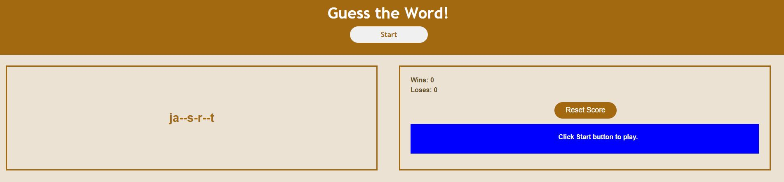
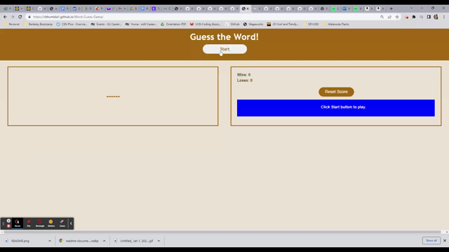

# Word Guess Game 
 A game application, using JavaScript and Web APIs, which allows user to guess words within a certain time period and keeps track of their wins and losses.

## Description
The game has the following features:

1. The user start the game by clicking on a button. This game is timed and the timer starts on clicking of the Start button.

2. The user try and guess a word by filling in a number of blanks that match the number of letters in that word.

3. The user wins the game when they have guessed all the letters in the word.

4. The user loses the game when the timer runs out before they have guessed all the letters.

5. Total wins and losses for the user are displayed on the screen. 

## Mock Up

Demo of the project:

## Usage
You can access:
1. the file in GitHub repository: https://github.com/rbhumbla1/Word-Guess-Game
2. the application using this URL: https://rbhumbla1.github.io/Word-Guess-Game

## License
None

